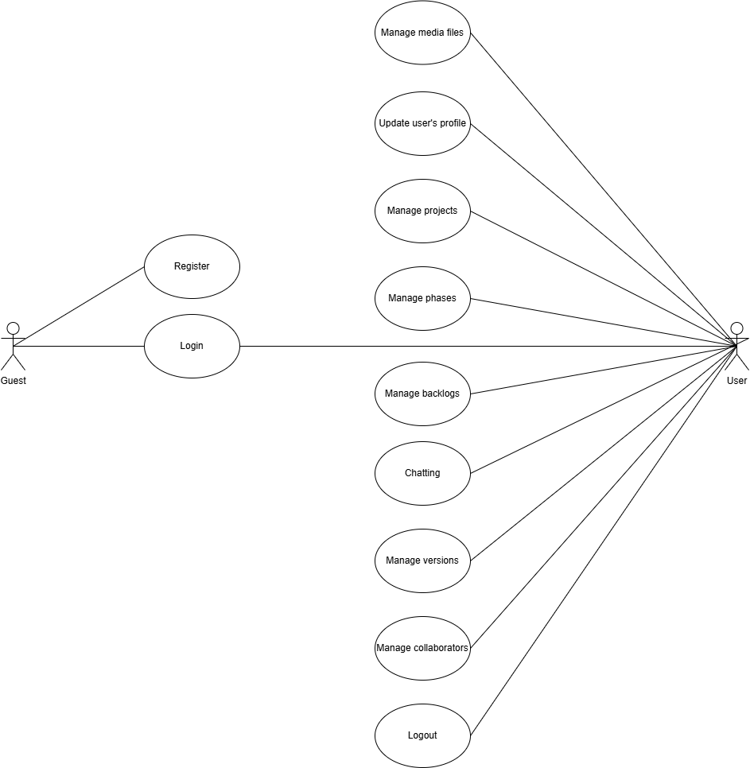
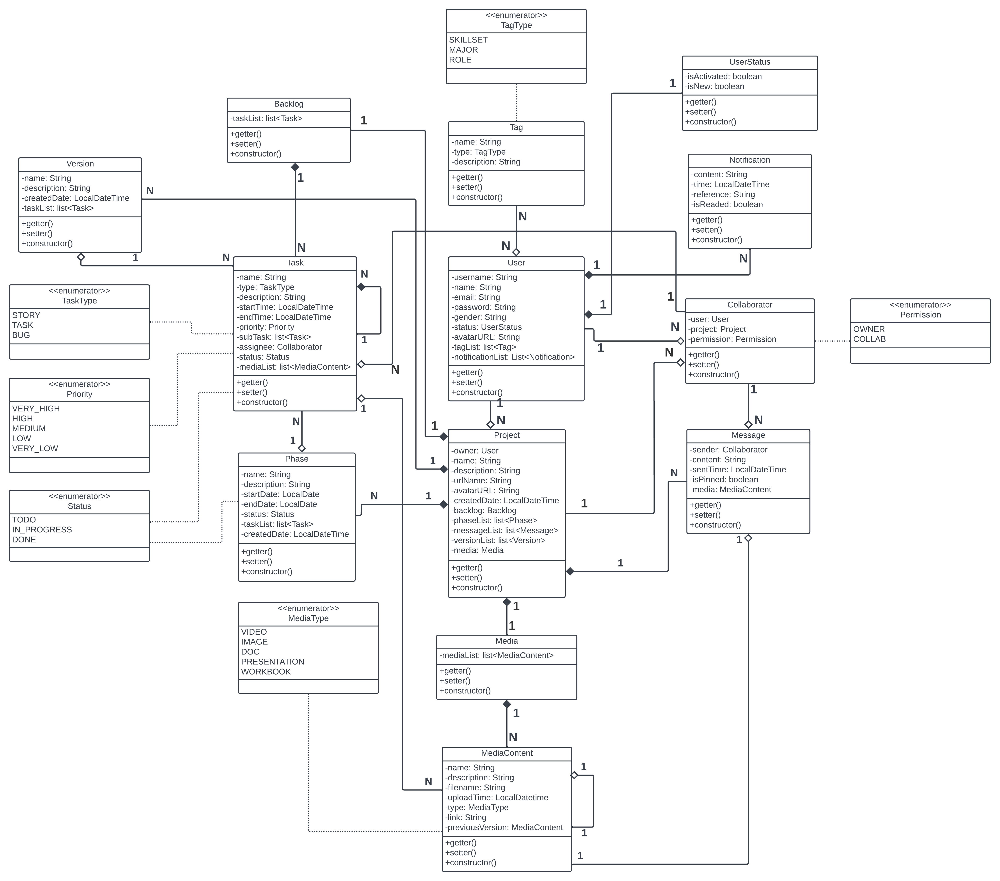

# Project CT

Final term project of the "Advanced Mobile Programming" course - Project Management App.

## Table of Contents

1. [Use Case Diagram](#use-case-diagram)
1. [Class Diagram](#class-diagram)
1. [Installation](#installation)
1. [Running the Project](#running-the-project)
1. [Project Structure](#project-structure)
1. [Contributors](#contributors)
1. [References](#references)

## Use Case Diagram



## Class Diagram



## Installation

1. **Clone the project from the repository**:

    ```sh
    git clone https://github.com/imloki03/LTDDNC_Group.git
    ```

2. **Install Expo CLI** (if not already installed):

    ```sh
    npm install -g expo-cli
    ```

3. **Open the project in Visual Studio Code**:

    - Launch **Visual Studio Code**.
    - Open the project folder by selecting `File > Open Folder...` and navigate to the folder where you cloned the repository.

4. **Install dependencies**:

    Inside the project folder, run the following command to install all necessary dependencies:

    ```sh
    npm install
    ```

## Running the Project

1. **Start the Expo development server**:

    In the terminal, run the following command to start the development server:

    ```sh
    npm start
    ```

    This will open a new tab in your browser with the Expo Developer Tools.

2. **Run the project on a device or simulator**:

    - **For iOS**: If you are on macOS, press the `i` key in the terminal or click the **Run on iOS Simulator** button in Expo Developer Tools to open the app on the iOS simulator.
    - **For Android**: If you have an Android device connected via USB or an Android emulator running, press the `a` key in the terminal or click the **Run on Android Device/Emulator** button in Expo Developer Tools.
    - Alternatively, you can scan the QR code displayed in the terminal using the **Expo Go** app on your physical Android or iOS device.

## Project Structure

Here's a brief overview of the project's structure:

```sh
ProjectCT/
│
├── .expo/                  # Expo configuration and logs
├── .idea/                  # IDE configuration 
├── assets/                 # Static assets (images, fonts, etc.)
├── node_modules/           # Node.js dependencies
├── src/                    # Main source directory
│   ├── api/                # API calls and configurations
│   ├── components/         # Reusable UI components
│   ├── constants/          # Constants
│   ├── hooks/              # Custom React hooks
│   ├── navigation/         # Navigation setup
│   ├── redux/              # Redux store and actions
│   ├── screens/            # Screen components
│   ├── services/           # Services
│   ├── styles/             # Global styles
│   └── utils/              # Utility functions
│
├── .gitignore              # Git ignore file
├── App.js                  # Main entry point of the app
├── app.json                # Expo configuration file
├── babel.config.js         # Babel configuration for JS/TS transpiling
├── package.json            # Project metadata and dependencies
├── package-lock.json       # Lock file for npm dependencies
└── README.md               # Project README file

```

## Contributors

1. [@imloki03](https://github.com/imloki03) - Nguyễn Văn Thi - 21110306
1. [@phancong1609](https://github.com/phancong1609) - Phan Lê Thành Công - 21110146

## References

- [ProjectCT API](https://github.com/imloki03/ProjectCT_TLCN)
